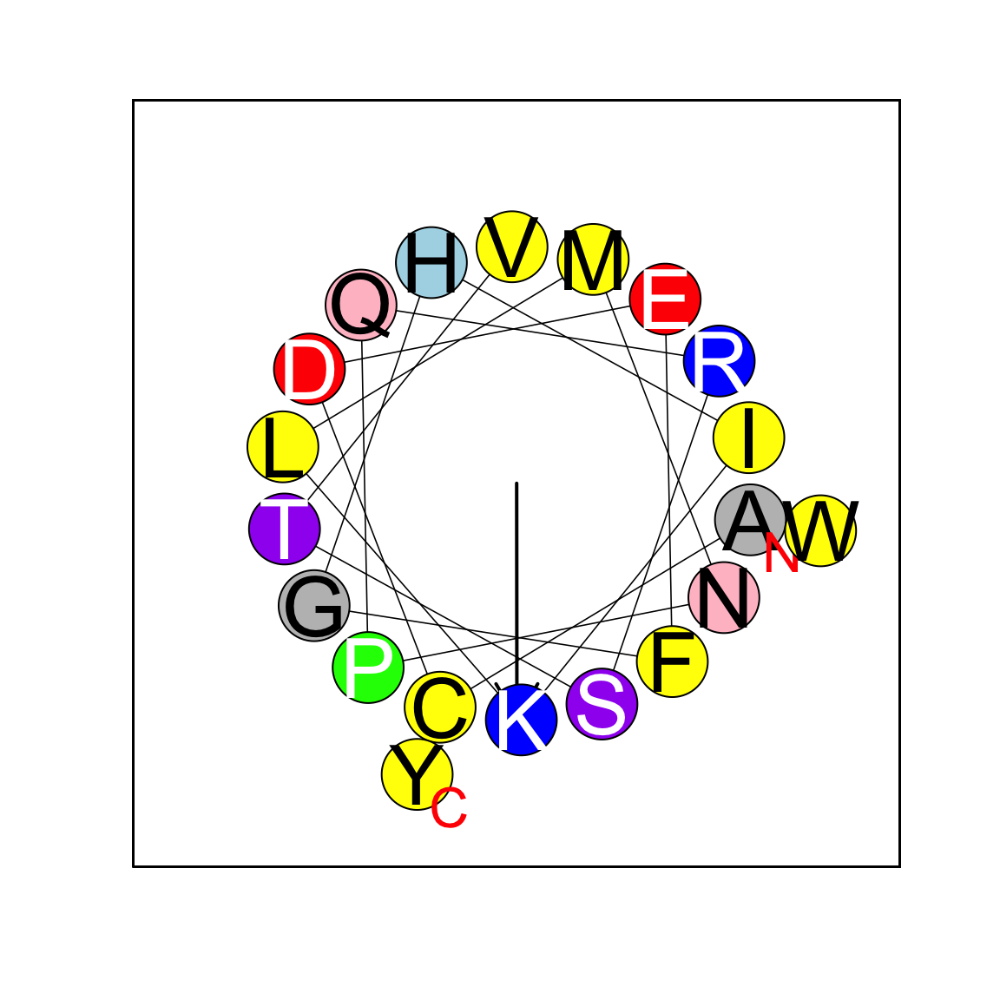

---
output:
  html_document:
    keep_md: yes
    toc: yes
---


# Helical wheel plots in R

## Installation


```r
# Until this package is on CRAN:
devtools::install_github("smsaladi/heliquest")
```

# Examples


```r
library(heliquest)

draw_helical_wheel("LGGLMNN")
```

```
## Loading required package: httr
```

```
## Warning in get_params(helix_seq, helix_type = helix_type): Sequence is less
## than 9 residues. Hydrophobic moment may not be a valid metric.
```


```r
draw_helical_wheel("ACDEFGHIKLMNPQRSTVWY",
                   FactC = 0.05, FONT1 = 3, FONT2 = 5,
                   CEXFT = 1, CEXTEXT = 0.8,
                   FlFH = 0, ANGT = 100,
                   NBMIN = 18, NBM2 = 36, NBMAX = 54)
```


```r
# Custom Angle and Hydrophobicity
draw_helical_wheel("ACDEFGHIKLMNPQRSTVWY",
                   FactC = 0.05, FONT1 = 3, FONT2 = 5,
                   CEXFT = 1, CEXTEXT = 0.8,
                   Ang = 30, Mom = 1,
                   FlFH = 0, ANGT = 100,
                   NBMIN = 18, NBM2 = 36, NBMAX = 54)
```


