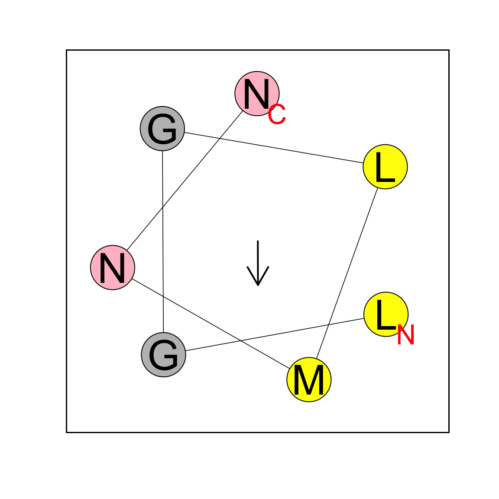
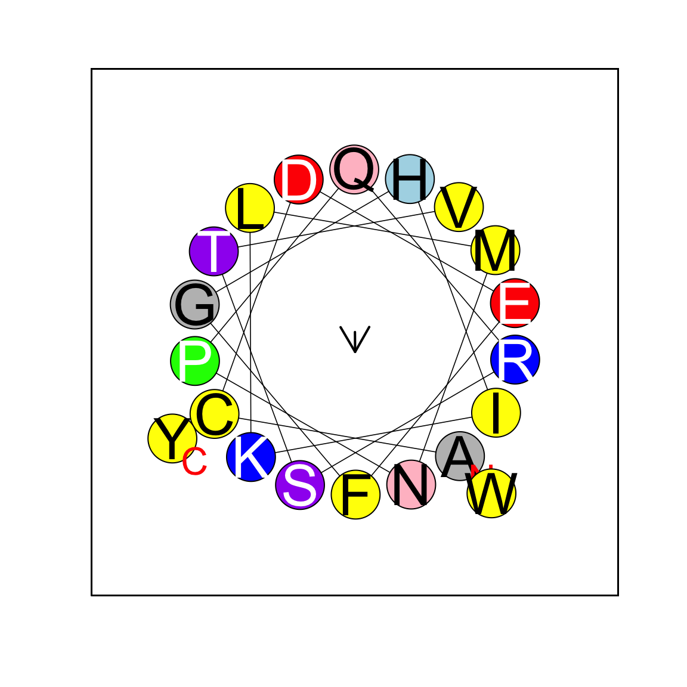

# Helical wheel plots in R

## Installation


```r
# Until this package is on CRAN:
devtools::install_github("saladi/heliquest")
```

# Examples


```r
library(heliquest)

draw_helical_wheel("KPKPKPKPKPKPKPKPKPKPKPKPKPKPK")
```



```r
draw_helical_wheel("ACDEFGHIKLMNPQRSTVWY",
                   FactC = 0.05, FONT1 = 3, FONT2 = 5,
                   CEXFT = 1, CEXTEXT = 0.8,
                   Ang = 5.58074390482, Mom = 0.122081976943,
                   FlFH = 0, ANGT = 100,
                   NBMIN = 18, NBM2 = 36, NBMAX = 54)
```


